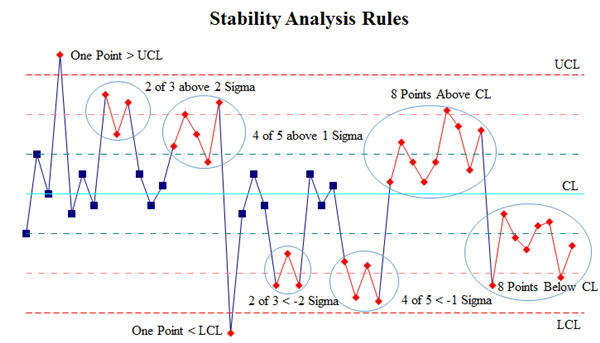

# Node.JS + Vega-Lite + Elasticsearch = a tasty mix

_**#Vega (Vega-Lite) | #SPC (Statistical Process Control) | #Node (Node.JS/Faker)**_

Welcome to the IoT Baking Company fictitious coding challenge, where you will be given a basic Node.JS application and a Vega-Lite JSON file for generating both the data stream and the basic graphs using Vega and Elasticsearch.

The challenge is to create better graphs, more meaningful data visualizations, implement correlations between data anomalies and trends, improve the overall visual impact of the graph, and create Elastic alarms for monitoring conditions.

The premise of our IoT requirements are to control the processes by which the company muffins are baked daily, by watching IoT sensors, dashboards, and getting alarm alerts in the event of an
"[excursion](https://www.semanticscholar.org/paper/Excursion-Yield-Loss-and-Cycle-Time-Reduction-in-Leachman-Ding/6e7491504f595f5d6d0c4cc4a0a9c073815a61b4)" in the baking assembly line. The image below is representative of our imaginary IoT Muffin Tray or the IMT as it is known on the production floor by our factory workers.

We will be sending sensor data from pins embedded in the muffin trays directly to Elasticsearch as the muffin trays travel through the baking process. If at any point in the production of the world's most tasty muffins with the secret ingredients and the baking recipe varies so much as one degree from perfection, the muffin is given to the food banks as a charity write-off for taxes.

Every batch of muffins gets a random ID assigned during the baking process for traceability in the event of an incident or customer complaints. The Muffin In Me software provided here is designed to simulate this whole process and produce an [SPC (Statistical Process Control) chart](https://www.qimacros.com/control-chart/stability-analysis-control-chart-rules/) on live real-time big screen TV monitors on the production floor for the supervisors to watch their IoT muffin making dashboards. The image below represents the typical statistical or stability process control chart by which quality metrics are analyzed and alarms are sent when the data points exceed either the upper or lower control limits. For a more detailed explanation, please see [What is Six Sigma Six?](https://www.sixsigmadaily.com/what-is-six-sigma/)

## Requirements and Instructions

1. Elasticsearch v7.x, Kibana, and Visualize tools for the database
   - [Elastic's Free Trial](https://www.elastic.co/cloud/elasticsearch-service/signup) or a paid subscription
   >**NOTE:** Be certain to save your credentials CSV file when you create your account
2. Vega-Lite Schema v4.x for the graphing of the data
   - [Vega-Lite: A Grammar of Interactive Graphics](https://vega.github.io/vega-lite/)
   > Check out the Vega-Lite example gallery - _Layering Rolling Averages over Raw Values_
3. Node.JS version 14.x or later to generate the data
   - [Install Node.JS](https://nodejs.org/en/download/)
4. npm packages (_tested with version 6.x_) to fake the data
   - `npm install -g npm@6`
5. CLI (Command Line Interface) any shell is fine to run the app
   - `npm run dev`
6. Clone the repository `git clone https://github.com/linuxwebexpert/iotmuffinme.git`
7. Edit your `.env` file and change the `ELASTIC_ENDPOINT` & `ELASTIC_CREDENTIALS` as needed
8. Using a shell window change to the working directory and install the dependencies `npm install`
9. Try running the application to see if data is being generated in developer mode `npm run dev`
10. Now go to your Elasticsearch installation and create an index for `muffin-1*`
11. Using **Kibana -> Visualize** insert the `vega-lite-spc.json` file code into the editor
12. You should see a graph like the one below:
